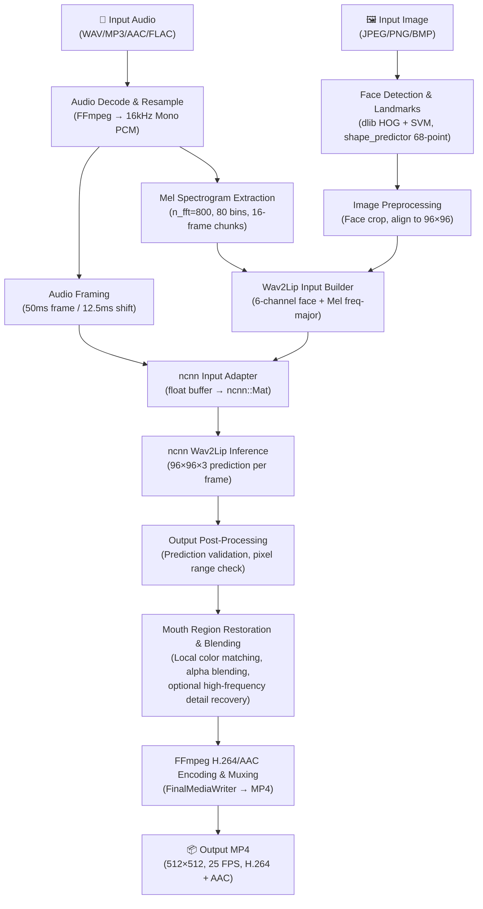

# Architecture

## Pipeline Overview



## Module Architecture

```
┌─────────────────────────────────────────────────────────┐
│                    Apps Layer                            │
│  digital_human_app.cpp  |  digital_human_cli.h          │
│  (CLI entry point, argument parsing, JSON result)       │
└────────────────────────┬────────────────────────────────┘
                         │
┌────────────────────────▼────────────────────────────────┐
│                  Pipeline Layer                          │
│  DigitalHumanPipeline  |  BoundedTaskQueue               │
│  PipelineComponents    |  PipelineOutputSink             │
│  (Orchestration: audio → inference → video, threading)  │
└────────────────────────┬────────────────────────────────┘
                         │
        ┌────────────────┼────────────────┐
        │                │                │
┌───────▼──────┐ ┌──────▼──────┐ ┌───────▼──────┐
│ Audio Module │ │ Model Module│ │ Output Module│
│ • Loader     │ │ • Loader    │ │ • MediaWriter│
│ • Framer     │ │ • Inference │ │   (FFmpeg)   │
│ • Mel Extract│ │ • Scheduler │ │              │
│ • Preprocess │ │ • Input     │ │              │
│ • Buffer     │ │ • Output    │ │              │
│              │ │ • Adapter   │ │              │
└──────┬───────┘ └──────┬──────┘ └──────┬───────┘
       │                │                │
┌──────▼────────────────▼────────────────▼──────┐
│                Core Layer                      │
│  • FaceDetector (dlib HOG + SVM frontal)      │
│  • FaceAligner (similarity transform)          │
│  • FaceBlender (color match, alpha blend,     │
│    high-frequency detail recovery)             │
│  • FaceMaskGenerator (lower-half mask)         │
│  • ImageLoader / ImagePreprocessor             │
│  • FrameScheduler / TimestampManager           │
└────────────────────────────────────────────────┘
```

## Data Flow (Per-Frame)

1. **Audio Path**: Raw audio → FFmpeg decode → 16kHz PCM → Mel spectrogram (80 bins × T frames) → 16-frame chunks (freq-major, 1280 floats)

2. **Visual Path**: Input image → dlib HOG + SVM face detection → 68-point shape_predictor landmarks → Face alignment (96×96 crop) → 6-channel construction (RGB × 2, lower-half zeroed)

3. **Inference**: Mel chunk (1×80×16) + Face (6×96×96) → ncnn forward pass → Generated face prediction (3×96×96)

4. **Post-Processing**: Prediction validation → Local color matching within mouth mask → Alpha blending with original face → Optional lightweight high-frequency detail recovery from original image

5. **Encoding**: Frame queue → H.264 video encoder + AAC audio encoder → MP4 muxer → Output file
